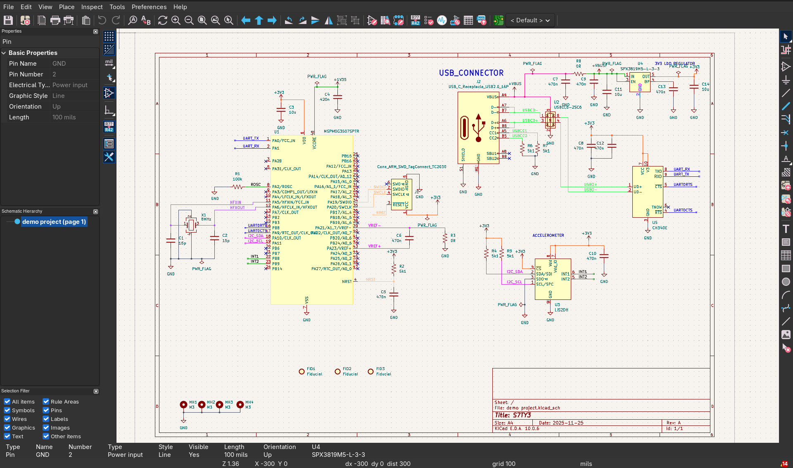
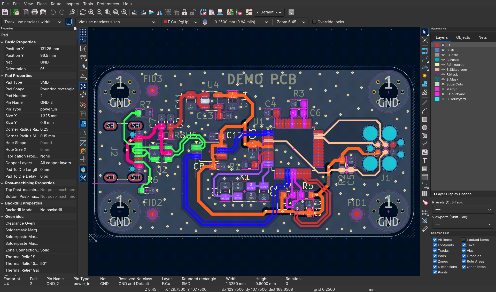
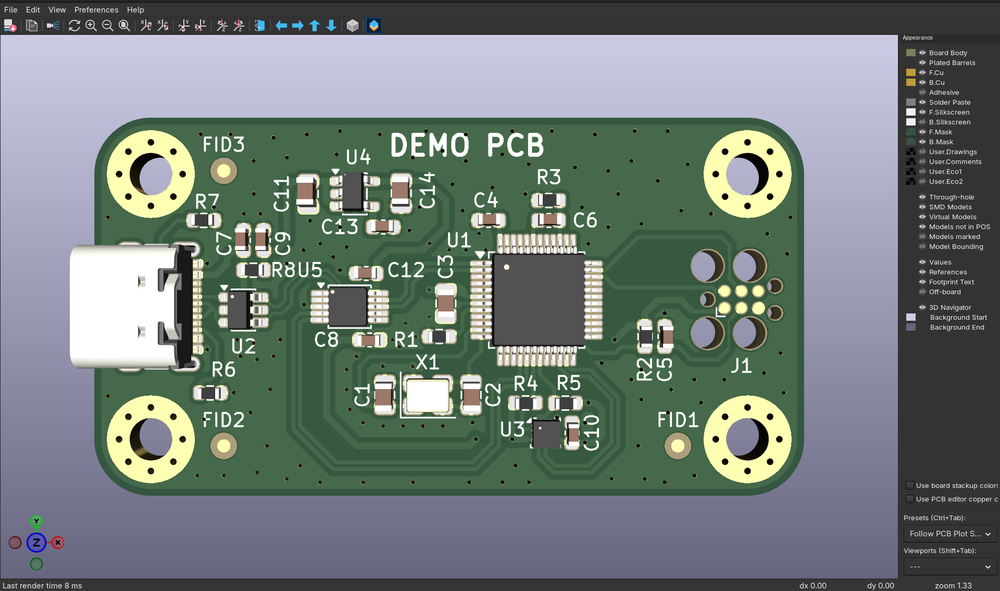

# demo project

A small KiCad learning project. I work mostly in Altium, so I built this board
end-to-end in KiCad to pick up the basics of the toolchain: schematic capture,
symbol/footprint libraries, net classes, placement and routing, and
manufacturing output. It is a tutorial reproduction, not original design work.

## Tutorial

Followed along with Phil's Lab KiCad 9 hardware design tutorial (TI MSPM0):

- Part 1 — Schematic: <https://www.youtube.com/watch?v=O-zNn5k5Bn4> (Phil's Lab #165)
- Part 2 — PCB: <https://www.youtube.com/watch?v=igQWdVGZGpI> (Phil's Lab #166)

## Hardware overview

2-layer dev board built around:

| Block | Part |
| --- | --- |
| MCU | TI MSPM0G3507 (LQFP-64) |
| USB | USB-C receptacle + USBLC6-2SC6 ESD protection |
| USB-UART bridge | WCH CH340E |
| Sensor | ST LIS2DH accelerometer (I2C) |
| Power | SPX3819M5-L-3-3 3.3 V LDO from VBUS |
| Debug | SWD via Tag-Connect TC2030 footprint |
| Misc | Crystal, fiducials, mounting holes |

Custom net classes are used for `3V3`, `GND`, `I2C`, `SW`, `UART`, `USB`,
`VBUS`, and `XTAL`.



## PCB

The board is a compact 2-layer layout with routing done against the custom net
classes, and a Tag-Connect footprint for SWD debug:



3D render of the populated top side:



## Repo layout

```
demo project.kicad_pro     project file
demo project.kicad_sch     schematic
demo project.kicad_pcb     layout
mspmo.kicad_sym            project-local symbol library (MSPM0, CH340E, ...)
sym-lib-table              ties the local library to the project
screenshots/               images used in this README
demo project-backups/      KiCad automatic backups
```

Open `demo project.kicad_pro` in KiCad 9 so the project-local symbol library
resolves correctly. The tutorial is written for KiCad 9 and I started it there,
but I later updated to KiCad 10 and everything carried over without issues.

## Manufacturing outputs

Fabrication files (Gerbers, drill, BOM, position files) live in `manufacturing/`
locally but are intentionally **gitignored**, so they are not in this repo — it
contains design sources only. If you're new to KiCad, the two tutorial parts
above walk through generating these outputs, and you can also regenerate them
yourself from `demo project.kicad_pcb` via *File → Fabrication Outputs*.
